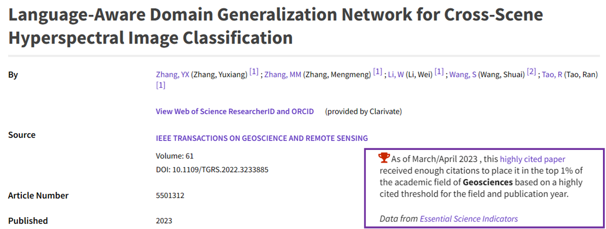
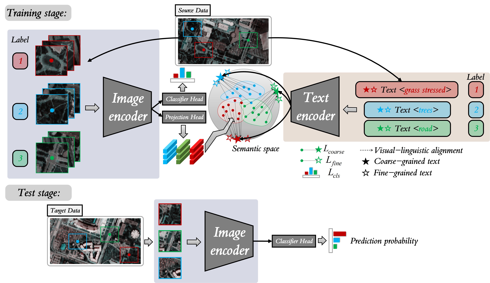

# Language-aware Domain Generalization Network for Cross-Scene Hyperspectral Image Classification

## Update 09/2023: LDGnet won the Highly Cited Paper.
<p align='center'>
  
</p>

Paper web page: [Language-aware Domain Generalization Network for Cross-Scene Hyperspectral Image Classificatio](https://ieeexplore.ieee.org/abstract/document/10005113).

Reading [知乎-Yammo](https://zhuanlan.zhihu.com/p/582966086)

<p align='center'>
  
</p>

## Abstract

Text information including extensive prior knowledge about land cover classes has been ignored in hyperspectral image classification (HSI) tasks. It is necessary to explore the effectiveness of linguistic mode in assisting HSI classification. In addition, the large-scale pre-training image-text foundation models have demonstrated great performance in a variety of downstream applications, including zero-shot transfer. However, most domain generalization methods have never addressed mining linguistic modal knowledge to improve the generalization performance of model. To compensate for the inadequacies listed above, a Language-aware Domain Generalization Network (LDGnet) is proposed to learn cross-domain invariant representation from cross-domain shared prior knowledge. The proposed method only trains on the source domain (SD) and then transfers the model to the target domain (TD). The dual-stream architecture including image encoder and text encoder is used to extract visual and linguistic features, in which coarse-grained and fine-grained text representations are designed to extract two levels of linguistic features. Furthermore, linguistic features are used as cross-domain shared semantic space, and visual-linguistic alignment is completed by supervised contrastive learning in semantic space. Extensive experiments on three datasets demonstrate the superiority of the proposed method when compared with state-of-the-art techniques.

## Paper

Please cite our paper if you find the code or dataset useful for your research.

```
@ARTICLE{10005113,
  author={Zhang, Yuxiang and Zhang, Mengmeng and Li, Wei and Wang, Shuai and Tao, Ran},
  journal={IEEE Transactions on Geoscience and Remote Sensing}, 
  title={Language-Aware Domain Generalization Network for Cross-Scene Hyperspectral Image Classification}, 
  year={2023},
  volume={61},
  number={},
  pages={1-12},
  doi={10.1109/TGRS.2022.3233885}}

```

## Requirements

CUDA Version: 11.3

torch: 1.11.0

Python: 3.8.10

## Dataset

The dataset directory should look like this:

```bash
datasets
├── Houston
│   ├── Houston13.mat
│   ├── Houston13_7gt.mat
│   ├── Houston18.mat
│   └── Houston18_7gt.mat
└── Pavia
    ├── paviaC.mat
    └── paviaC_7gt.mat
    ├── paviaU.mat
    └── paviaU_7gt.mat

```

## Usage

1.You can download [Houston &amp; Pavia](https://github.com/YuxiangZhang-BIT/Data-CSHSI) dataset here, and the CLIP pre-training weight [ViT-B-32.pt](https://openaipublic.azureedge.net/clip/models/40d365715913c9da98579312b702a82c18be219cc2a73407c4526f58eba950af/ViT-B-32.pt) here.

2.You can change the `source_name` and `target_name` in train.py to set different transfer tasks.

3.Run python train_queue.py.

## Note

- The variable names of data and gt in .mat file are set as `ori_data` and `map`.
- For Pavia dataset and Houston dataset, args.re_ratio is set to 1 and 5, respectively
